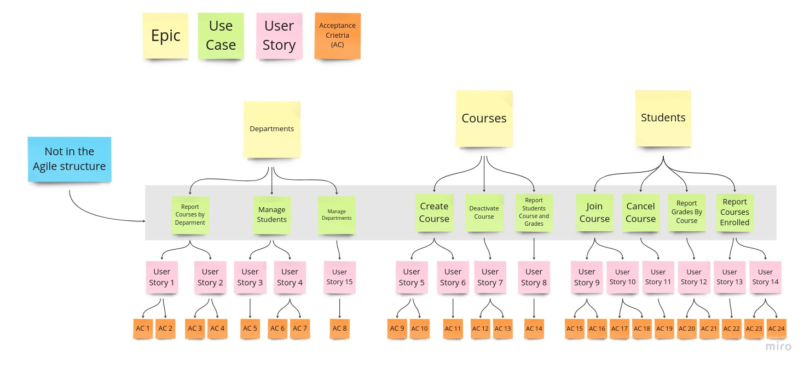

# living-doc-kotlin-spring-sample

This project is a sample using Kotlin, Cucumber, Serenity and Gradle to show some features for a BDD approach
to generate project business documentation into the SDLC (software development life cycle). The idea is to bring some 
light about the chance of though the product versions delivery make it possible to have the business explained according
to the testing validations done and the business requirements those validations are related to.

To make it possible it was created a fictitious business scenario for a course center to illustrate an example of 
this approach. Through the business definitions it proposes an organization of the topics similar to an Epic/User Stories
organization to describe the validation cases and business rules applied to it.

## The Business Scenario and Modeling

According to the mentioned idea, here is the fictitious scenario to help us to describe the living documentation approach. 
To make it closer to an ongoing project following an Agile SDLC, we are going to have features done, features in validation, 
and pending features to be implemented. So it is taken in consideration that it is like a sprint development, following a 
prioritized backlog for a small product.

Taking this previous description in consideration, here follows a class diagram to bring an idea of the domain model for the
project. In this domain it is possible to consider as main business concepts: departments, courses, and students. Those 
domain concepts will be mapped as the epics for this project, and they will be the criteria for the user stories classification.


Here comes the point where it is proposed for developing the features a possible BDD approach. The stories that join the sprint had 
its business scope and technical definition discussed, and the first step is to create the Gherkin readme.md and feature files 
to allow the description of the acceptance criteria test cases. Due to the acceptance criteria test cases defined in the 
Gherkin files, in the application test scope it is necessary to create the test case classes with pending implementation. 
The expected result in the end of the feature implementation is the software feature developed, and tested. Before bring an 
example related to this it could be interesting to take a look in the application use cases that will be the source of information 
to the user stories.

### User Stories for the sample scenario

To have a summary of the business rules related to the domain areas it is possible to propose a set of propositions to help 
describe a set os use cases scope:

- There are 4 possible user types: DEPARTMENT_ADMIN, DEPARTMENT_OFFICER, STUDENT, TEACHER.
- The DEPARTMENT_ADMIN profile can manage department information.
- The DEPARTMENT_ADMIN and DEPARTMENT_OFFICER profiles can manage students information.
- The DEPARTMENT_ADMIN and DEPARTMENT_OFFICER profiles use reports to have information of courses by departments.
- The STUDENT, DEPARTMENT_ADMIN and DEPARTMENT_OFFICER profiles use reports to have information about a student grades by course.
- The DEPARTMENT_ADMIN and DEPARTMENT_OFFICER profiles can create and deactivate courses.
- The STUDENT profile can request to join a course.
- The STUDENT profile can request to cancel a course participation.
- The STUDENT, DEPARTMENT_ADMIN and DEPARTMENT_OFFICER profiles can use a report to check the courses a student is enrolled.

#### Departments use cases


#### Courses use cases


#### Students use cases


### Expected result over the documentation

The expected results is to have a separation of topics according to the project epics (Departments, Students, Courses). The project epics
will be the starting point to crate the user stories relates to those mapped use cases presented previously. Each use case will be related to a set
of user stories that will describe the application features. And for each user story there will be available some acceptance 
criteria that will validate the business rule to be followed. It is possible to consider it will be something like this:



This structure will be the concept to create the files in the documentation for the BDD test cases and specification. Since it is common to 
group the user stories in epics, the layer described as use cases will be not present in the documentation. The files structure will
be explained better when presenting it in the source code project. 

## Project configuration and structure

The project configuration and structure was created based on information found on the official serenity documentation, [official Serenity GitHub 
repositories](https://github.com/serenity-bdd), and also other additional sources found on the web. The idea was to create the most clean and 
minimum configuration needed to run the project to allow the report to be generated through an application build.

Starting by the [Gradle dependencies](build.gradle.kts), it is possible to highlight the default tasks configuration, the serenity-gradle-plugin plugin, 
and the set of dependencies itself. Among the dependencies, it was necessary the junit-vintage-engine because most of the implementation found for the 
configuration classes were using JUnit4 structures. Without it this was not possible to run the tests integrated to the Gradle build. Besides that it was 
necessary the test task configuration for running the aggregated step from the serenity plugin after the tests task execution. The resulting build Gradle 
file was the following one:

```Kotlin
import org.jetbrains.kotlin.gradle.tasks.KotlinCompile

defaultTasks("clean", "test", "aggregate")

plugins { 
  id("org.springframework.boot") version "3.0.2"
  id("io.spring.dependency-management") version "1.1.0"
  id("org.graalvm.buildtools.native") version "0.9.18"
  id("net.serenity-bdd.serenity-gradle-plugin") version "3.5.0"
  kotlin("jvm") version "1.7.22"
  kotlin("plugin.spring") version "1.7.22"
  kotlin("plugin.jpa") version "1.7.22"
}

group = "com.tnfigueiredo"
version = "0.0.1-SNAPSHOT"
java.sourceCompatibility = JavaVersion.VERSION_17

repositories {
  mavenCentral()
}

dependencies {
  implementation("org.springframework.boot:spring-boot-starter-web")
  implementation("org.springframework.boot:spring-boot-starter-data-jpa")
  implementation("org.flywaydb:flyway-core")
  implementation("com.fasterxml.jackson.module:jackson-module-kotlin")
  implementation("org.jetbrains.kotlin:kotlin-reflect")
  implementation("org.jetbrains.kotlin:kotlin-stdlib-jdk8")
  testImplementation("org.springframework.boot:spring-boot-starter-test")
  testImplementation("net.serenity-bdd:serenity-core:3.7.1")
  testImplementation("net.serenity-bdd:serenity-cucumber:3.7.1")
  testImplementation("net.serenity-bdd:serenity-junit5:3.7.1")
  testImplementation("net.serenity-bdd:serenity-spring:3.7.1")
  testImplementation("org.junit.vintage:junit-vintage-engine:5.9.2")
  testImplementation("io.cucumber:cucumber-spring:7.11.0")
  testImplementation("com.h2database:h2")
}

tasks.withType<KotlinCompile> {
  kotlinOptions {
    freeCompilerArgs = listOf("-Xjsr305=strict")
    jvmTarget = "17"
  }
}

tasks.withType<Test> {
  useJUnitPlatform()
  testLogging.showStandardStreams = true
  finalizedBy("aggregate")
}
```

### Document files structure

[//]: # (Mention the Gherkin + test cases integration)
[//]: # (Show how to create readme files and gherkin files)

### Project build and report results

[//]: # (Show report structure)

### How to integrate living documentation in CI/CD Pipelines

[//]: # (Github actions example)
[//]: # (find somewhere to publish. best approach local docker contianer for the sample)

## Finally:

[//]: # (sprint flow and SLDC software deliverables include docs)

## Content sources

- https://cucumber.io/docs/bdd/
- https://cucumber.io/docs/gherkin/reference/
- https://serenity-bdd.github.io/docs/reporting/living_documentation
- https://github.com/serenity-bdd
- https://johnfergusonsmart.com/getting-started-with-serenity-bdd-and-cucumber-4/
- https://stackoverflow.com/questions/59456120/cannot-run-cucumber-junit-tests-on-gradle