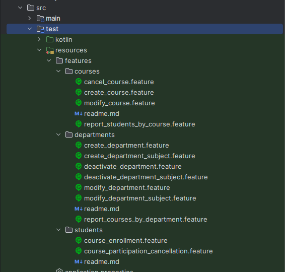
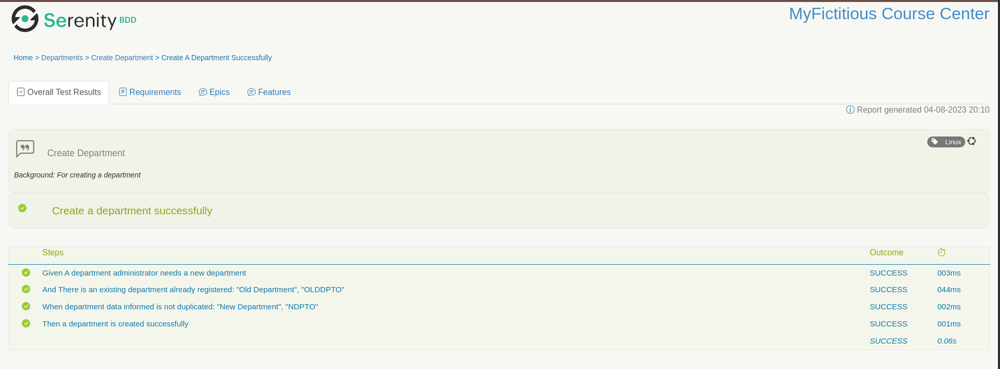

# living-doc-kotlin-spring-sample

This project is a sample using Kotlin, Cucumber, Serenity and Gradle to show some features for a BDD approach
to generate project business documentation into the SDLC (software development life cycle). The idea is to simulate product 
versions delivery producing together business documentation and software deliverable that matches. All this through a BDD 
approach to match both using acceptance criteria validations.

To make it possible it was created a fictitious business scenario for a course center to illustrate an example of 
this approach. Through the business definitions it proposes an organization of the topics similar to an Epic/User Stories
organization to describe the validation cases and business rules applied to it.

## The Business Scenario and Modeling

According to the mentioned idea, here is the fictitious scenario to help us to describe the living documentation approach. 
To make it closer to an ongoing project following an Agile SDLC, we are going to have features done, features in validation, 
and pending features to be implemented. So it is taken in consideration that it is like a sprint development, following a 
prioritized backlog for a small product.

Taking this previous description in consideration, here follows a class diagram to bring an idea of the domain model for the
project. In this domain it is possible to consider as main business concepts: departments, courses, and students. Those 
domain concepts will be mapped as the epics for this project, and they will be the criteria for the user stories classification.


Here comes the point where it is proposed for developing the features a possible BDD approach. The stories that join the sprint had 
its business scope and technical definition discussed, and the first step is to create the Gherkin readme.md and feature files 
to allow the description of the acceptance criteria test cases. Due to the acceptance criteria test cases defined in the 
Gherkin files, in the application test scope it is necessary to create the test case classes with pending implementation. 
The expected result in the end of the feature implementation is the software feature developed, and tested. Before bring an 
example related to this it could be interesting to take a look in the application use cases that will be the source of information 
to the user stories.

### User Stories for the sample scenario

To have a summary of the business rules related to the domain areas it is possible to propose a set of propositions to help 
describe a set os use cases scope:

- There are 4 possible user types: DEPARTMENT_ADMIN, DEPARTMENT_OFFICER, STUDENT, TEACHER.
- The DEPARTMENT_ADMIN profile can manage department information.
- The DEPARTMENT_ADMIN and DEPARTMENT_OFFICER profiles can manage students information.
- The DEPARTMENT_ADMIN and DEPARTMENT_OFFICER profiles use reports to have information of courses by departments.
- The STUDENT, DEPARTMENT_ADMIN and DEPARTMENT_OFFICER profiles use reports to have information about a student grades by course.
- The DEPARTMENT_ADMIN and DEPARTMENT_OFFICER profiles can create and deactivate courses.
- The STUDENT profile can request to join a course.
- The STUDENT profile can request to cancel a course participation.
- The STUDENT, DEPARTMENT_ADMIN and DEPARTMENT_OFFICER profiles can use a report to check the courses a student is enrolled.

#### Departments use cases


#### Courses use cases


#### Students use cases


### Expected result over the documentation

The expected result is to have a separation of topics according to the project epics (Departments, Students, Courses). The project epics
will be the starting point for create the user stories. Each use case above has a set of scenarios that describe the business needs. Those
business needs will be the input to create the user stories that will describe the application features. And for each user story, there will
be available some acceptance criteria that will validate the business rule to be followed. It is possible to consider it will be something like this:


This structure will be the concept to create the files in the documentation for the BDD test cases and specification. Since it is common to 
group the user stories in epics, the layer described as use cases will be not present in the documentation. The files structure will
be explained better when presenting it in the source code project. 

## Project configuration and structure

The project configuration and structure was created based on information found on the official serenity documentation, [official Serenity GitHub 
repositories](https://github.com/serenity-bdd), and also other additional sources found on the web. The idea was to create the most clean and 
minimum configuration needed to run the project to allow the report to be generated through an application build.

Starting by the [Gradle dependencies](build.gradle.kts), it is possible to highlight the default tasks configuration, the serenity-gradle-plugin plugin, 
and the set of dependencies itself. Among the dependencies, it was necessary the junit-vintage-engine because most of the implementation found for the 
configuration classes were using JUnit4 structures. Without it this was not possible to run the tests integrated to the Gradle build. Besides that it was 
necessary the test task configuration for running the aggregated step from the serenity plugin after the tests task execution. The resulting build Gradle 
file was the following one:

```Kotlin
import org.jetbrains.kotlin.gradle.tasks.KotlinCompile

defaultTasks("clean", "test", "aggregate")

plugins { 
  id("org.springframework.boot") version "3.0.2"
  id("io.spring.dependency-management") version "1.1.0"
  id("org.graalvm.buildtools.native") version "0.9.18"
  id("net.serenity-bdd.serenity-gradle-plugin") version "3.5.0"
  kotlin("jvm") version "1.7.22"
  kotlin("plugin.spring") version "1.7.22"
  kotlin("plugin.jpa") version "1.7.22"
}

group = "com.tnfigueiredo"
version = "0.0.1-SNAPSHOT"
java.sourceCompatibility = JavaVersion.VERSION_17

repositories {
  mavenCentral()
}

dependencies {
  implementation("org.springframework.boot:spring-boot-starter-web")
  implementation("org.springframework.boot:spring-boot-starter-data-jpa")
  implementation("org.flywaydb:flyway-core")
  implementation("com.fasterxml.jackson.module:jackson-module-kotlin")
  implementation("org.jetbrains.kotlin:kotlin-reflect")
  implementation("org.jetbrains.kotlin:kotlin-stdlib-jdk8")
  testImplementation("org.springframework.boot:spring-boot-starter-test")
  testImplementation("net.serenity-bdd:serenity-core:3.7.1")
  testImplementation("net.serenity-bdd:serenity-cucumber:3.7.1")
  testImplementation("net.serenity-bdd:serenity-junit5:3.7.1")
  testImplementation("net.serenity-bdd:serenity-spring:3.7.1")
  testImplementation("org.junit.vintage:junit-vintage-engine:5.9.2")
  testImplementation("io.cucumber:cucumber-spring:7.11.0")
  testImplementation("com.h2database:h2")
}

tasks.withType<KotlinCompile> {
  kotlinOptions {
    freeCompilerArgs = listOf("-Xjsr305=strict")
    jvmTarget = "17"
  }
}

tasks.withType<Test> {
  useJUnitPlatform()
  testLogging.showStandardStreams = true
  finalizedBy("aggregate")
}
```

Considering this initial project configuration there is the test source code structure and the business specification and BDD files 
structure. For the test source code there are 3 main components:

- AcceptanceTestRunner: This class has the configuration for the Test Suit runner and the Cucumber configurations. It was used a default 
configuration that can read the whole Spring context to the dependencies injection for the test context and the path for the 
feature files.
- CucumberSpringConfiguration: An empty stub just to enable the Cucumber context for a Spring Test class.
- StepsDefinition classes: Those classes have the implementation for the Given/When/Them BDD validations related to the description 
written in the feature files. For this sample, they were grouped according to the Use Case definitions.


Since the idea of this sample is to present what could be a project development iteration, the feature files will have some concrete 
implemented test cases, and some pending test cases in the master branch. There is one branch that will simulate a successful iteration development with new 
successful implemented test cases. And there is another branch which will simulate failing test cases implementation. This will allow to make it 
visible in the Serenity reports the overview of the features to be implemented, and also how it behaves while the features is being developed.

### Document files structure

The sample of this project follows the recommended file structure mentioned on the [Serenity official 
documentation](https://serenity-bdd.github.io/docs/reporting/living_documentation#the-requirements-hierarchy). This file structure 
was organized into a hierarchy for Epics and features, being the feature files used to describe a set of User Stories. The Epics are 
described through "readme.md" files, which bring the Epic business description. The feature files represent the Use Cases description, 
which will group the User Stories related to that:



Once the files structure is described it is easier to understand how the Given/When/Then BDD definitions written in the Gherkin files 
are related to the steps definition implementation. In this sample, the Use Case feature file is related to the StepsDefinition BDD test 
implementation, except for the Students Epic which has the implementation in a single class:

- manage_courses.feature -> CoursesManagementStepsDefinition.kt
- report_students_by_course.feature -> CoursesReportStepsDefinition.kt
- manage_departments.feature -> DepartmentsManagementStepsDefinition.kt
- report_courses_by_department.feature -> DepartmentsReportStepsDefinition.kt
- course_enrollment.feature and course_participation_cancellation.feature -> StudentsManagementStepsDefinition.kt

Here follows an example for the mentioned files structure:

- Feature specification

```Gherkin
Feature: Manage Courses

  A use case description...

  Rule: A business rule...

    Scenario: Create a course successfully
      Given A department administrator needs to manage course information
      And there is an existing course: "MyCourse1", "MyC1", "Programming", "2023-02-18", "2023-06-16"
      When it is informed the course information: "MyCourse2", "MyC2", "Programming", "2023-07-18", "2023-12-16"
      Then a course is created successfully
```

- Steps Definition Implementation

```Kotlin
package com.tnfigueiredo.docsample.bdd.courses

import...

class CoursesManagementStepsDefinition {
    
    private lateinit var creator: GeneralUser

    @Given("A department administrator needs to manage course information")
    fun givenDepartmentAdministratorNeedsManageCourseInformation(){
        creator = GeneralUser(1, "dptoAdmin", UserProfile.DEPARTMENT_ADMINISTRATOR)
    }

    @And("there is an existing course: {string}, {string}, {string}, {string}, {string}")
    fun andExistingCourseAvailable(courseName: String, courseCode: String, area: String, startDate: String, endDate: String){
        //TODO Implement
    }

    @When("it is informed the course information: {string}, {string}, {string}, {string}, {string}")
    fun whenCourseInformationIsInformed(courseName: String, courseCode: String, area: String, startDate: String, endDate: String){
        //TODO Implement
    }

    @Then("a course is created successfully")
    fun thenCourseCreatedSuccessfully(){
        //TODO Implement
    }
}
```

### Running the sample

To being able to explore the project it is possible to have it on your favorite IDE ([IntelliJ](https://www.jetbrains.com/idea/guide/tutorials/working-with-gradle/opening-a-gradle-project/), 
[Eclipse](https://www.jhipster.tech/configuring-ide-eclipse-gradle/), [VSCode](https://code.visualstudio.com/docs/java/java-build)). Once you have the project on you favorite IDE 
each of them have their own mechanisms to rum Gradle builds. Due to the previously presented build.gradle.kts configuration file 
it is possible to run a simple Gradle build locally to check the application build results. Before running the Gradle build be sure of 
having the properly Java version (Java 17) installed and configured on you local machine. All the other dependencies are the ones
mentioned in the [Gradle dependencies](build.gradle.kts):

On Linux machines:

```CONSOLE
./gradlew build
```

On Windows Machines:

```CONSOLE
gradlew.bat build
```

In a Github repository it is easy to create a Gradle Github actions build configuration. In this repo there is an example on 
[Github Gradle build actions file](https://github.com/tnfigueiredo/living-doc-kotlin-spring-sample/blob/master/.github/workflows/gradle.yml). 
The following section shows how to evaluate the report results for a Gradle build.

### Project build and report results

For this sample it was not created any special configuration for the report output folders. Considering so, the project source code 
remains being generated on the project build folder, while the results for the Serenity reports are generated in the target folder. 
The resulting report is generated in an HTML files format, into the folder structure ./target/site/serenity:


It is possible to open the resulting report in a browser through the index.html file generated in the Serenity reports folder. 
The first view this index.html file presents in the report is an overview about the project test cases grouped by a set os possible 
status. This overview also presents tests statistics and classification. In the case of this sample by Epic and Features: 


The Requirements tab present and overview about the epics and the features classification, together with the test coverage scenario:


The Capabilities tab presents the Epics summary test cases:


It is possible to check the "readme.md" epic file description when you click in a Capability:


The Features tab presents the Features summary test cases:


When accessing a specific feature it is possible to check the feature description and the summary of its test cases:


And if it is accessed a specific test case it is possible to see its execution and description:



### How to integrate living documentation in CI/CD Pipelines

If it is taken into consideration that the modern software development approach works over a Continuous Integration and Continuous Delivery (CI/CD) 
approach, it is impossible not to consider all that was mentioned here outside of this context. Just for a quick recap, a project CI/CD
cycle will have some steps related to application build and testing. Here is where this proposal matches a CI/CD approach, allowing the project
to apply a continuous testing approach. Every single delivery cycle will have business requirements, test cases description, project documentation,
and production product being delivered in the release stage.


The configuration available in the [build file](https://raw.githubusercontent.com/tnfigueiredo/living-doc-kotlin-spring-sample/master/.github/workflows/gradle.yml) 
is related to the build and test stages commonly represented in the CI/CD pipeline approaches. For reasons of simplification, this project is just
attaching the bdd reports results to the project build. But it is possible to use the report results to publish it anywhere which is possible of having available 
HTML content.

## Finally:

The idea of this sample is to bring some possibilities about how to link your project business documentation together with a project 
delivery lifecycle, allowing to bring visibility to future features, delivered features, what is being validated as project business 
behavior. And this can be customized to the project characteristics and project lifecycle behavior. It is possible to have those 
deliverables every spring, maybe in every project tag, or even in every feature delivery.

If it is taken in consideration other approaches to create software project documentation, it is possible to mention that the main pros 
are the fact that documentation is done together with software development, the documentation format is simple, it is possible to link 
documentation with software validation process, and the documentation is always aligned with the software behavior. As cons it is possible 
mention that for initial setup it is necessary technical background and setup (which may delay initial software documentation), there are 
tools easy to use that allows to document the software in not so technical approach and in a flexible way.

## Content sources

- https://cucumber.io/docs/bdd/
- https://cucumber.io/docs/gherkin/reference/
- https://serenity-bdd.github.io/docs/reporting/living_documentation
- https://github.com/serenity-bdd
- https://johnfergusonsmart.com/getting-started-with-serenity-bdd-and-cucumber-4/
- https://stackoverflow.com/questions/59456120/cannot-run-cucumber-junit-tests-on-gradle
- https://medium.com/luizalabs/descomplicando-a-clean-architecture-cf4dfc4a1ac6